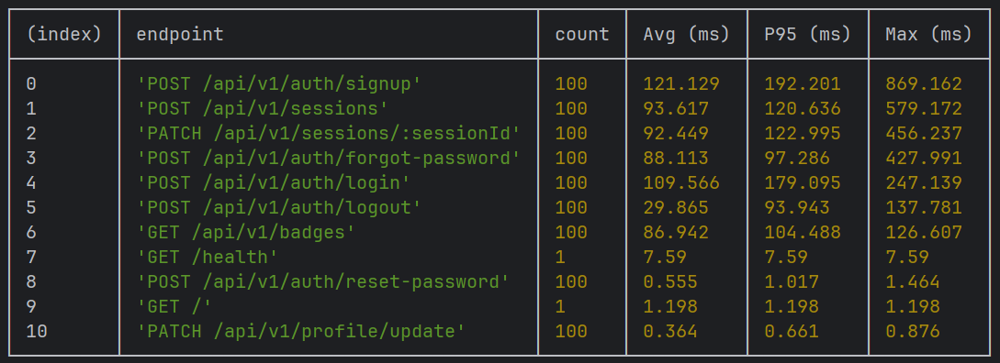
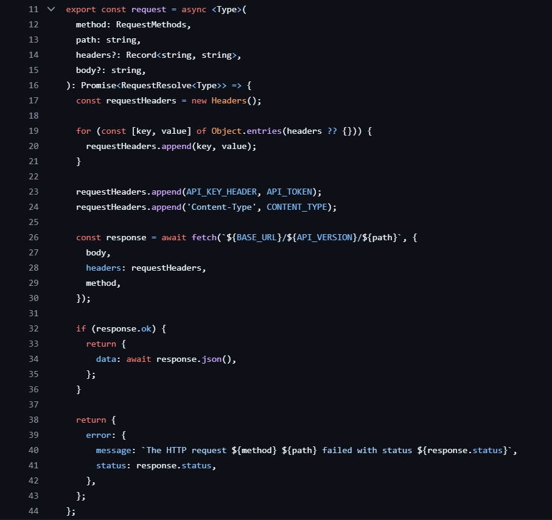
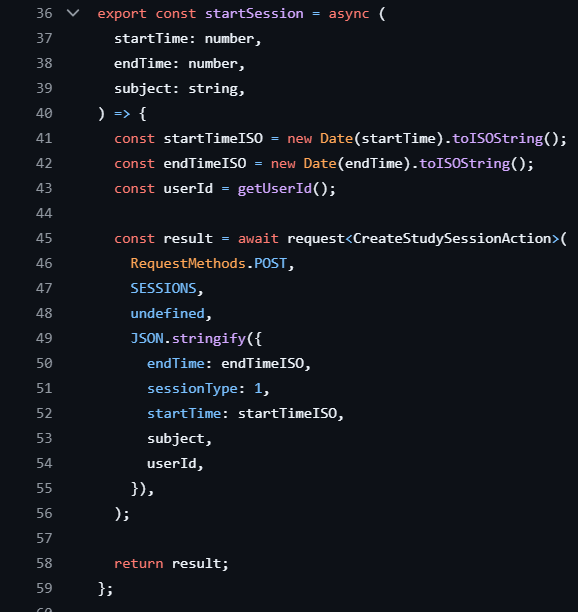

# 1\. Regression Testing Strategy

## Overview
Our regression testing suite runs automatically on every pull request and push to the main branch via GitHub Actions CI/CD pipeline. This ensures that new changes do not break existing functionality.
For our needs, we decided upon doing a complete regression testing implementation rather than other options such as selective regression testing or risk based regression testing. While we could have implemented these optimized regression testing options as we do have certain files such as supabase.js (has configs), and strings.js(just constant strings), that change very rarely, and we could have modified our CI scripts to handle these less changing/risk areas in a more optimized manner. But what we found is that since our project is small and we are still developing and adding more features, the extra time it takes to run all the test suits across all aspects of the project was negligible for us. And it was more important for us to get our application up and running for this sprint.

## Tests Breakdown 
Since we do a complete regression testing, here is what we are testing:
### Backend Tests (apps/backend)
1. **Unit Tests** 
   - Location: `Studly/apps/backend/tests/unit`
   - Runner: Node.js built-in test runner
   - Coverage: this tests code in isolation.
   
2. **Integration Tests** 
   - Location: `Studly/apps/backend/tests/integration`
   - Coverage: this is testing components working together, such as our session testing. 
   
3. **Code Quality Checks**
   - ESLint: Syntax and code style validation
   - Biome: Code formatting and organization

### Frontend Tests (apps/frontend)
1. **Unit Tests** - Such as Components and utilities
   - Location: `apps/frontend/src`(each folder has tests alongside its code)
   - Runner: Vitest
   - Coverage: React components, hooks, utilities etc

2. **Integrations Tests** - Such as Routes
   - Location: `apps/frontend/src/routes` (there are other integration tests in other folders as well)
   - Runner: Vitest
   - Coverage: this is testing components working together.

3. **End-to-End Tests** - User workflows
   - Location: `Studly/apps/frontend/cypress/e2e/`
   - Runner: Cypress

4. **Code Quality Checks**
   - Biome: Code formatting and organization

## Tools Used
- **GitHub Actions**: CI/CD orchestration
- **Node.js Test Runner**: Backend unit tests
- **Vitest**: Frontend unit tests
- **Cypress**: End-to-end tests
- **ESLint**: Static code analysis
- **Biome**: Code formatting and linting

## Test Execution Process
1. Developer creates a pull request
2. GitHub Actions automatically triggers CI pipeline
3. All regression tests run in parallel (backend + frontend)
4. PR is blocked if any tests fail
5. Green checkmark indicates all tests passed
6. Code can be merged to main branch

This process allows us to make sure any code we are pushing does not immediately break any existing logic. 

## Regression Testing Script

Our regression tests are automated via GitHub Actions CI/CD pipeline:
- **Location**: `.github/workflows/ci.yml`
- **View on GitHub**: [CI Workflow](Studly/.github/workflows/ci.yml at main · HaMeD1379/Studly)

# 2\. Testing Slowdown

## 1\. Have you been able to keep all unit and integration tests from your test plan?

-   For frontend developement, we have been capable of keeping pace with creating tests as we develop each part of the front end code. Nothing major has slowed us down.

-   For backend development, we have been able to create tests immediately and tests such as for new a API like profile. However we sometimes had to put to the side the tests till after we had our API's fully connected with front end, as that was our major focus for this sprint.

## 2\. Have you created different test plans for different release types? Explain.

-   The front end still has the same testing plan we decided in our earlier sprint, and have been following that for this sprint.

-   For the backend, we have been mostly following the same testing plan as the previous sprint, but sometimes had to put it to the side to get everything working first.  

# 3\. Not Testing

## What parts of the system are not tested?

- The user authentication for each api once the user is inside the application, like who can access badges, is not tested via a middleware. This is because superbase has row level security for this instance, so we decided not to for this sprint 2 as our priority was to get our application together. For sprint 3, we will be adding this.
- For the frontend, end-to-end (e2e) tests are not implemented yet, in order for us to fully implement e2e testing, we needed the API hooked up to the backend. Now that we have the setup done from this sprint, we will be doing full e2e testing for sprint 3.
- Some routes on the frontend are missing an integration test suite, this is because they have not been connected yet. The UI is made but without the API hooked up with loaders and actions, there isn’t a need to spend time making tests on mock data that will be replaced later. Though, others such as the study, login, sign up routes are complete.
- Two files in the frontend, auth.ts and main.ts are missing a test suite, but that is known and planned to be fixed right as sprint 3 starts.

## System diagram.
- Our system/architecture diagram is same as our initial sprint.

## Each tier:

-   Backend fully tested:

-   Front end fully tested:

# 4. Profiler Analysis

After running the profiler on the API, the following observations were made from the output:

### Which endpoint is the slowest?
The `POST /api/v1/auth/signup` endpoint is the slowest. It has the highest average response time (121.129 ms), the highest 95th percentile time (192.201 ms), and the highest maximum response time (869.162 ms).

### Is the slowdown fixable — and why/why not?
The slowdown is likely inherent to the nature of the signup operation and may not be easily "fixed," but it is understandable. The signup process involves several steps:
- Validating user input
- Checking if the user already exists
- Hashing the password (computationally intensive by design)
- Creating a new user record in the Supabase database

Password hashing and initial database writes are expected to take longer compared to simpler operations like login or profile updates. While the performance is acceptable for a signup endpoint, potential optimizations could include ensuring the database is indexed appropriately. However, given the endpoint's purpose, the current performance is reasonable.

# 5\. Last Dash

## What issues do you foresee in the final sprint?

-   Some issues we can see for our final sprint is trying to make sure we have all the core functionality complete and fully functional. At the start when developing, we prioritized splitting up the different aspects of our project to each member so we can make some progress on different featuers. However we did not necessarily making sure the app was connected from the start, as this resulted in having different features that were not used, and some essential features not connected as early as they should have been.
-   So by the end of sprint 1 and begining of sprint 2, we had many different features ready, but connecting them together was challenging. So which meant meants sprint 2 was focused on connecting different aspects, thus leaving other features to be pushed to the next sprint. Which means that for the final sprints, we would need to end up working on the rest of the api's and features that we sidelined as fast as possible and get it all connected and up and running. 

# 6\. Show Off

-   Each team member highlights their best work (code, UI, design, integration, mocks, etc.).

-   Remember: good refactored code should be simple and elegant.

Each member must commit their own update --- commit logs will be checked.

---
## Ben:
As part of the push to connect the frontend to the backend API, an abstracted API layer was created and I am quite proud of the design I created for it. There is a general purpose request utility that can take in the request method, body and header, and then dynamically add required headers such as the API key from .env. This handles the logic for errors or it parses json if the API fetch passes.

The GitHub file is here in [request.ts](../../apps/frontend/src/utilities/requests/requests.ts).

This request function also is a general purpose function you can pass a general type which allows calls to this function to be given back in an enforced type.

We can use this general purpose function in more direct API calls, such as here in [session.ts](../../apps/frontend/src/api/sessions.ts).

This allows us to put the fetch into one general utility and then create application specific calls and functions for each endpoint. This makes it easy in the frontend loaders and actions since all we have to do is provide the parameters taken from the frontend and then pass them these endpoint functions. Strict type enforcing through the general function type ensures we are returning the correct result and acting on it correctly. There is no usage of fetch or any concern of how the API is called from the perspective of the UI components, it is completely abstracted away through this design.
---
## Anthony:
---
## Hamed:
---
## Shiv:
---
## Shashika:

---
# Commitment statements:

Ben:
I will contribute by: Building frontend UI and managing the infrastructure of it.
I can commit 5 hours per week.
I will give updates every 2-3 days.
If blocked, I will communicate within 12 hours.

Anthony:
I will contribute by developing the frontend and hooking up the Api
I can commit 8 hours per week
I will give updates every 2 days
If blocked, I will communicate within 12 hours

Hamed:
I will contribute by developing the backend sessions API endpoints and DevOps related setups
I can commit 5 hours per week
I will give updates every 1 days
If blocked, I will communicate within 6 hours

Shiv:
I will contribute by: managing the database and helping out building api.
I can commit 4 hours per week
I will give updates every 2 days
If blocked, I will communicate within 8 hours.

Shashika :
I will contribute by working on the badge api, as well as incorporating feedback from previous meetings
I can commit 5 hours per week
I will give updates every 1 days
If blocked, I will communicate within 6 hours
